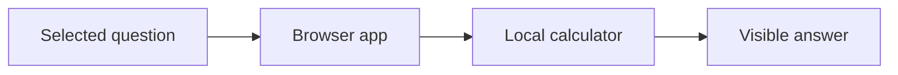
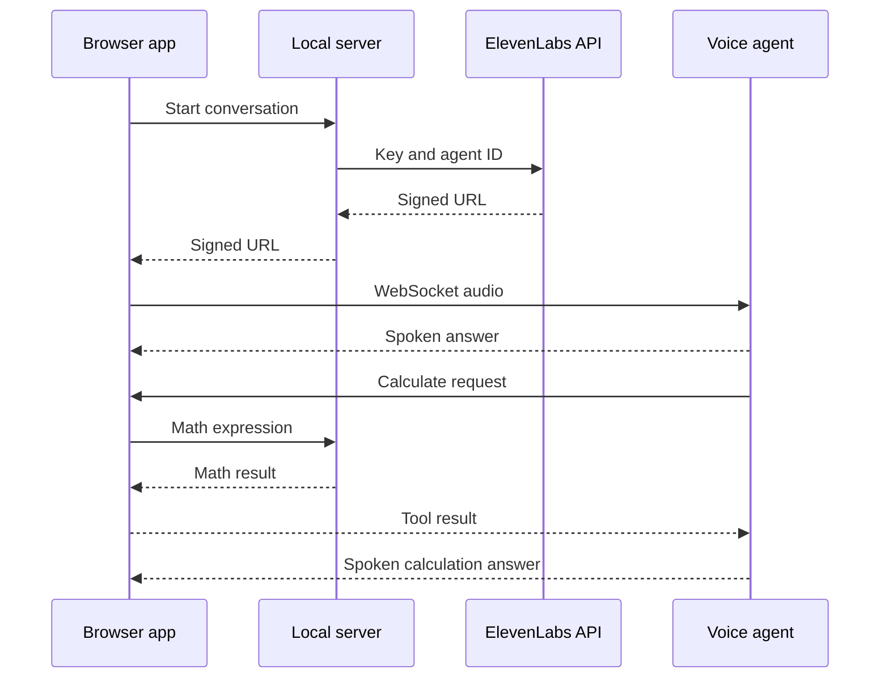
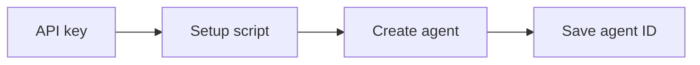

# Presentation Maker: diagram specification

Instruction-based sample using its diagram-slides workflow. This plugin proposes labels and layout; it does not independently render an external deck.

## 1. Demo calculation
Type: process. Direction: left to right. Highlight: local calculator in teal. Labels have four words or fewer.

## 2. Live conversation
Type: sequence. Show the return path explicitly.

## 3. Automatic setup
Type: process. Highlight: the saved ID, to explain why the user need not enter it manually.

The diagram specification is the Presentation Maker contribution. Mermaid rendering is a separate host capability. The key is server-side; no real credentials are included.
